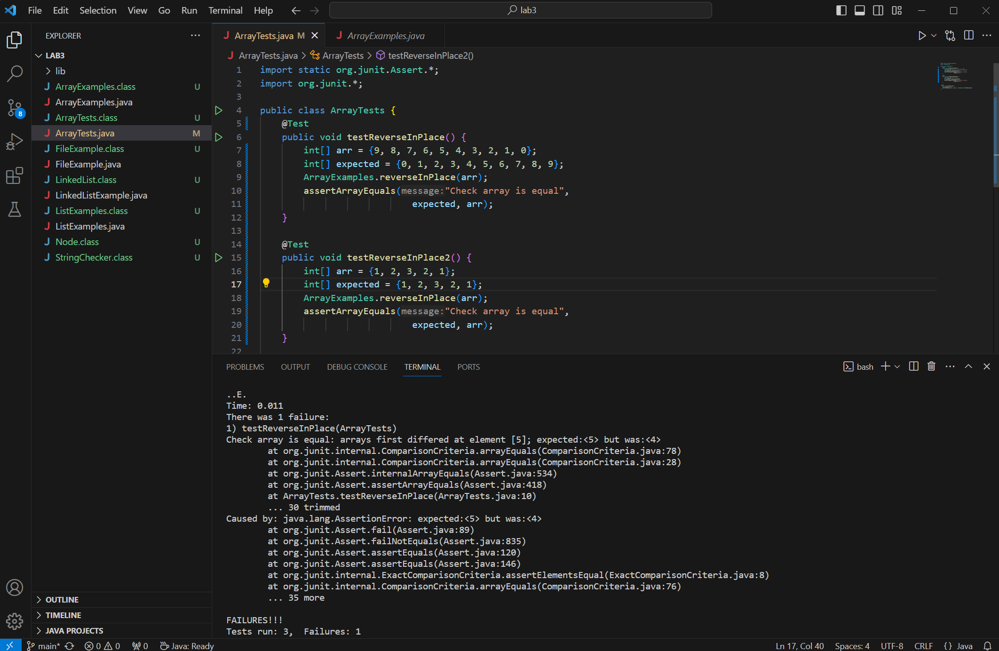

# 1. Bugs
**For this method, this Junit test method will cause an error:** \
```
public void testReverseInPlace() {
        int[] arr = {9, 8, 7, 6, 5, 4, 3, 2, 1, 0};
        int[] expected = {0, 1, 2, 3, 4, 5, 6, 7, 8, 9};
        ArrayExamples.reverseInPlace(arr);
        assertArrayEquals("Check array is equal",
                            expected, arr);
}
```
\
**This Junit test will not cause an error:** \
```
public void testReverseInPlace2() {
        int[] arr = {1, 2, 3, 2, 1};
        int[] expected = {1, 2, 3, 2, 1};
        ArrayExamples.reverseInPlace(arr);
        assertArrayEquals("Check array is equal",
                            expected, arr);
}
```
**Screenshot of the symptoms:**
\
\
The symptoms as a test output\
\
**The bug before fixing:**
```
static void reverseInPlace(int[] arr) {
    for(int i = 0; i < arr.length; i += 1) {
      arr[i] = arr[arr.length - i - 1];
    }
  }
```
**The bug after fixing**
```
static void reverseInPlace(int[] arr) {
    int[] new = new int[arr.length];
    for(int i = 0; i < arr.length; i += 1) {
      new[i] = arr[arr.length - i - 1];
    }
    arr = new;
  }
```
This change addresses the issue because the original values at the indices are overwritten, \
and so when you get to the second half of the array, the elements are just reassigned the values\
which were overwritten, not the original values of the first half.\
\
# 2. Researching commands
grep:\
`-c` prints only a count of lines which match a pattern. This would be useful to see how often a term appears.\
Input: `grep -c "passenger" chapter-1.txt`\
Output: `40`\
Input: `grep -c "flight" chapter-1.txt`\
Output: `74`\
`-h` display the matched lines, but not the file names. This would be useful to make it easier to read the output.\
Input: `grep -h "final conversation" chapter-1.txt`\
Output: `It would be their final conversation.`\
Input: `grep -h "depart at 8:00" chapter-1.txt`\
Output: `Their flight was scheduled to depart at 8:00.`\  
`-i` ignores case matching. This would be useful to see all instances of a word.\
Input: `grep -i "finaL conVeRSatIon" chapter-1.txt`\
Output: `It would be their final conversation.`\
Input: `grep -i "dePArt At 8:00" chapter-1.txt`\
Output: `Their flight was scheduled to depart at 8:00.`\  
`-n` display the line number. This would be useful if you are looking through a long file and you want to find something.\
Input: `grep -n "final conversation" chapter-1.txt`\
Output: `20:  It would be their final conversation.`\
Input: `grep -n "depart at 8:00" chapter-1.txt`\
Output: `26:  Their flight was scheduled to depart at 8:00.`\  


  
